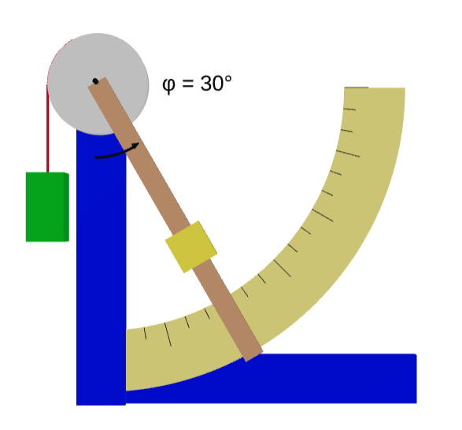

# Torque Balance Neuron
Use the lever balance to simulate the functioning and learning of a neuron (in the sense of artificial intelligence).

## Mechanical device
The instrument is a mechanical deflection-mode torque-balance letter scale comprising a cylindrical drum, a rigid lever arm, an adjustable counterweight, and a suspended plate driven by a rope. The scale measures mass by rotating to an equilibrium angle between 0° and 90°, defined by the balance of gravitational moments and rope tension. The design assumes idealized, negligible friction in bearings and rope contact.

  

STL (ascii) 3D file [here](src/playground.stl)

## Nomenclature

| Repère | Quantité | Nom | Matière | Dimension |
|--------|----------|-----|---------|-----------|
| A      | 1        | Base 1 | Bois | L=120mm (9x38) |
| B      | 1        | Base 2 | Bois | L=220mm (9x38) |
| C      | 1        | Support vertical | Bois | L=300mm (9x38) |
| D      | 1        | Cadran gradué | Contreplaqué | (ép: 3mm) |
| E      | 1        | Tambour | Contreplaqué | R=75mm (ép: 12mm) |
| F      | 1        | Corde | Synthétique | L=200mm |
| G      | 1        | Crochet | Laiton | |
| H      | 1        | Roulement à bille | Acier | |
| I      | 1        | Vis M8 | Acier | M8x40mm |
| J      | 2        | Écrou M8 | Acier | |
| K      | 1        | Levier | Bois | | L=250mm l=34mm (ép: 5mm) |
| L      | 1        | Vis M6 (contrepoids) | Acier | M6x40mm |
| M      | 1        | Écrou (contrepoids) | Acier | |

## PoC View

  
  
  
  

## QCM pour l'évaluation

QCM (Questionnaire à Choix Multiple)

## Ressources

* [Grille](src/GrilleProcedure.txt) pour chaque époque du SDGD
* [QCM](src/QCM_Neurone_Mecanique.pdf) avec correction
